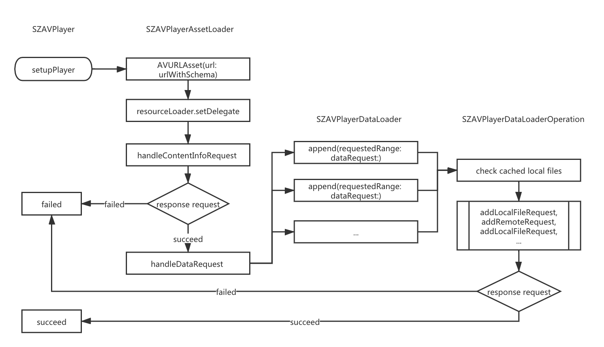

# SZAVPlayer

[](https://cocoapods.org/pods/SZAVPlayer)
[](https://github.com/Carthage/Carthage)
[](https://swift.org/package-manager/)
[](https://cocoapods.org/pods/SZAVPlayer)
[](https://cocoapods.org/pods/SZAVPlayer)

[中文说明](./README_cn.md)

SZAVPlayer is a lightweight audio/video player library, based on `AVPlayer`, pure-Swift. Support cache and video image output.

## Features

- [x] Encapsulate the state changes of `AVPlayer` and `AVPlayerItem` and output them uniformly, greatly reducing the implementation cost of audio/video play.
- [x] Achieved full control of `AVPlayer` data loading, based on `AVAssetResourceLoaderDelegate`. Through the Range request and corresponding cache, it can respond to player's requests ASAP. It also can play the cached audio/video normally in the weak network and no network enviroment.
- [x] Support video image output, can be drawn to multiple views at the same time.
- [x] Load AVAsset asynchronously to not blocking the main thread.
- [x] Support setting cache size munually and also support cleaning.

## Main Flow



## Hint

> If you find that always play failed in the simulator, try exit simulator completely and restart again. This is kind of simulator's bug.

## Usage

1. Create player and set delegate.

    ```swift
    let player = SZAVPlayer()
    player.delegate = self
    
    audioPlayer = player
    ```

2. Setup player with url.

    ```swift
    // uniqueID is to identify wether they are the same audio. If set to nil will use urlStr to create one.
    let config = SZAVPlayerConfig(urlStr: audio.url, uniqueID: nil)
    audioPlayer.setupPlayer(config: config)
    ```
    
    or
    
    ```swift
    // If you want play video, pass an additional parameter `isVideo`.
    let config = SZAVPlayerConfig(urlStr: video.url, uniqueID: nil, isVideo: true, isVideoOutputEnabled: true/false)
    videoPlayer.setupPlayer(config: config)
    ```

3. Implement `SZAVPlayerDelegate`.

    ```swift
    extension AudioViewController: SZAVPlayerDelegate {
    
        func avplayer(_ avplayer: SZAVPlayer, refreshed currentTime: Float64, loadedTime: Float64, totalTime: Float64) {
            progressView.update(currentTime: currentTime, totalTime: totalTime)
        }
    
        func avplayer(_ avplayer: SZAVPlayer, didChanged status: SZAVPlayerStatus) {
            switch status {
            case .readyToPlay:
                SZLogInfo("ready to play")
                if playerStatus == .playing {
                    audioPlayer.play()
                }
            case .playEnd:
                SZLogInfo("play end")
                handlePlayEnd()
            case .loading:
                SZLogInfo("loading")
            case .loadingFailed:
                SZLogInfo("loading failed")
            case .bufferBegin:
                SZLogInfo("buffer begin")
            case .bufferEnd:
                SZLogInfo("buffer end")
                if playerStatus == .stalled {
                    audioPlayer.play()
                }
            case .playbackStalled:
                SZLogInfo("playback stalled")
                playerStatus = .stalled
            }
        }
    
        func avplayer(_ avplayer: SZAVPlayer, didReceived remoteCommand: SZAVPlayerRemoteCommand) -> Bool {
            return false
        }
    
    }
    ```
    
4. Replace new audio.

    ```swift
    // The setupPlayer function will automatically determine if it has been setup before. 
    // If it is, it will directly call the replacePalyerItem function to replace the new audio.
    audioPlayer.setupPlayer(config: config)
    ```
    
    or
    
    ```swift
    // or just use this function.
    audioPlayer.replace(urlStr: audio.url, uniqueID: nil)
    ```
    
    these two functions have the same effect.
    
5. Enable video image output.

    - Set `isVideoOutputEnabled ` to `true`.
    
    ```swift
    let config = SZAVPlayerConfig(urlStr: video.url, uniqueID: nil, isVideo: true, isVideoOutputEnabled: true)
    videoPlayer.setupPlayer(config: config)
    ```
    
    - Implement avplayer delegate function.
    
    ```swift
    func avplayer(_ avplayer: SZAVPlayer, didOutput videoImage: CGImage) {
        videoOutputView1.layer.contents = videoImage
    }
    ```
    
    - Call `removeVideoOutput` function when ready to release the player.
    
    ```swift
    videoPlayer.removeVideoOutput()
    ```
    
6. Seek player to time.

    ```swift
    audioPlayer.seekPlayerToTime(time: currentTime, completion: nil)
    ```
    
7. Set max cache size.

    ```swift
    // Unit: MB, if reached the max size, it will automatically trim the cache.
    SZAVPlayerCache.shared.setup(maxCacheSize: 100)
    ```
    
8. Clean all cache.

    ```swift
    SZAVPlayerCache.shared.cleanCache()
    ```
    
9. Play local files. Because there is no need to go through the custom loading process for local files, directly set `disableCustomLoading` to `true`.

	```swift
	let config = SZAVPlayerConfig(urlStr: audio.url, uniqueID: nil)
	config.disableCustomLoading = true
	audioPlayer.setupPlayer(config: config)
	```

## Example

The Example project has implemented a complete play example, including play/pause/previous/next/seekToTime/cleanCache, etc. 

To run the example project, clone the repo, and run `pod install` from the Example directory first.

## Requirements

- iOS 10.0+
- Swift 5.0+

## Installation

### CocoaPods

SZAVPlayer is available through [CocoaPods](https://cocoapods.org). To install
it, simply add the following line to your Podfile:

```ruby
pod 'SZAVPlayer'
```

### Carthage

[Carthage](https://github.com/Carthage/Carthage) is a decentralized dependency manager that builds your dependencies and provides you with binary frameworks. To integrate SZAVPlayer into your Xcode project using Carthage, specify it in your `Cartfile`:

```ogdl
github "eroscai/SZAVPlayer" ~> 1.1.1
```

### Swift Package Manager

From Xcode 11, you can use [Swift Package Manager](https://swift.org/package-manager/) to add SZAVPlayer to your project.

- Select File > Swift Packages > Add Package Dependency. Enter https://github.com/eroscai/SZAVPlayer.git in the "Choose Package Repository" dialog.
- Add `CoreServices.framework` and `AVFoundation.framework` to your project if not added before. (If anyone knows how to do this automatically, please tell me).

## Author

eroscai, csz0102@gmail.com

## License

SZAVPlayer is available under the MIT license. See the LICENSE file for more info.
